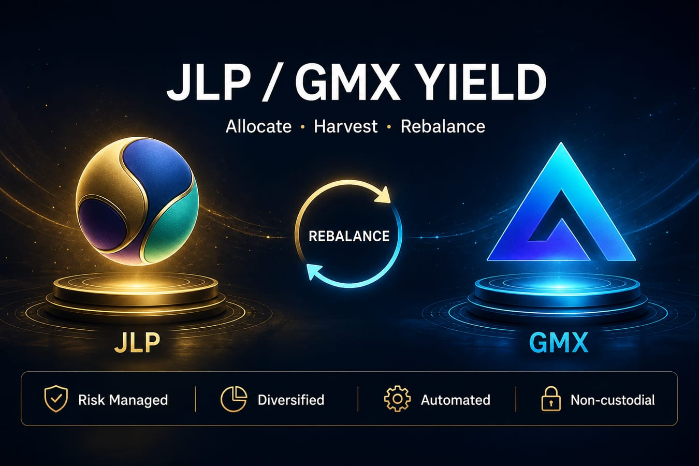
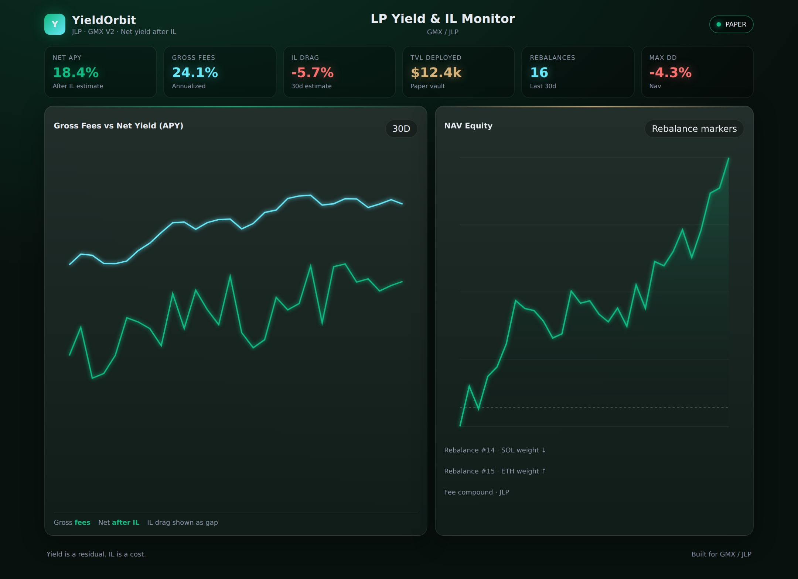
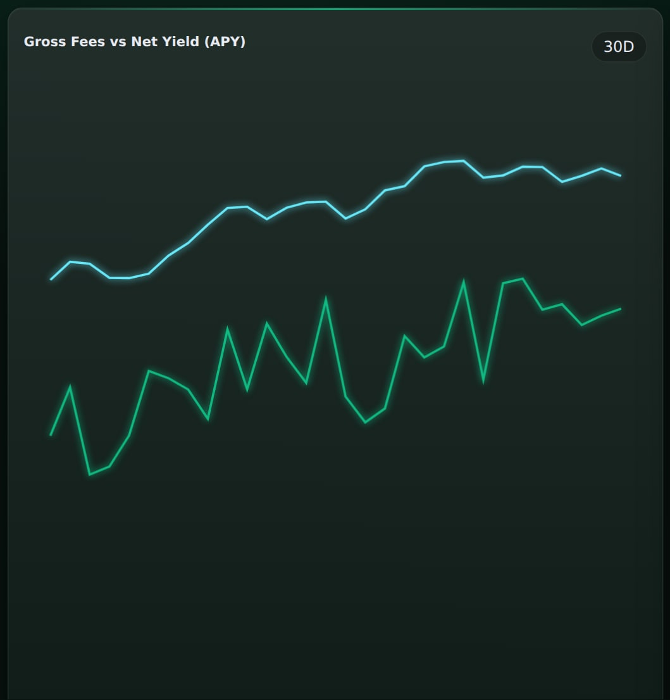
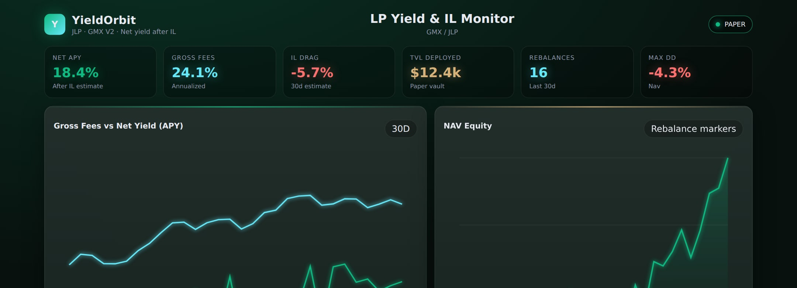
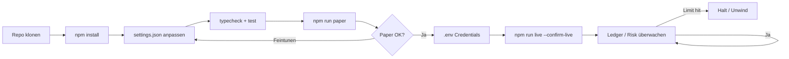
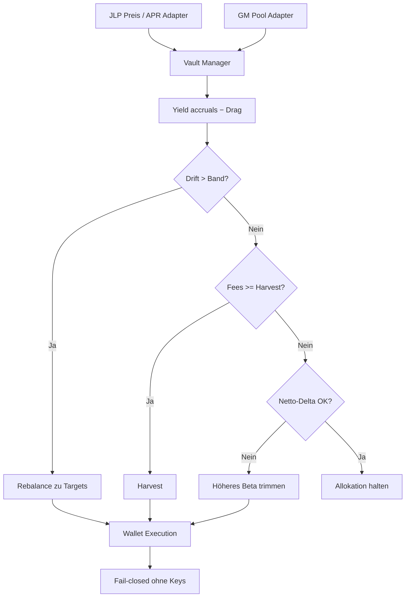

<p align="center">
  
</p>

# JLP- & GMX-LP-Yield-Bot

<p align="center">
  <strong>Das House sein — allokieren, ernten, rebalancieren</strong><br/>
  Jupiter JLP · GMX GM Pools · Drift-Rebalancing · Net-Delta-Budgets
</p>

<p align="center">
  
  
  
  
  
</p>

<p align="center">
  Sprachen: [English](README.md) · [中文](README.zh.md) · **Deutsch** · [Español](README.es.md)
</p>

> **Suchbegriffe:** JLP APY · GMX GM Pool · Crypto LP Yield Bot · Jupiter JLP

2026 sitzt viel „Easy Yield“ auf der **anderen Seite der Trader** — LP/Vaults wie **JLP** und **GM**. Der Bot behandelt sie als **Portfolio**: Zielgewichte, Fee-Harvest, Drift-Rebalance und Delta-Caps.

---

## Performance-Snapshot

Demo-Analytics aus dem statischen Dashboard (`npm run dashboard`). Banner und Strategie-Diagramme bleiben erhalten.

<p align="center">
  
</p>

<p align="center">
  
</p>

<p align="center">
  
</p>

---

## Projekt-Workflow

Vom Klonen bis Live: zuerst Paper, dann Credentials, Risk Guard immer aktiv.



| Befehle | |
|---------|--|
| `npm run paper` | Zuerst Paper-Modus |
| `npm run dashboard` | Lokales Analytics-Dashboard öffnen (statisch) |
| `npm run live` | Benötigt `--confirm-live` + Credentials |
| `npm test` / `npm run typecheck` | CI-local gates |

---

## Produktversprechen

| | |
|--|--|
| Dual-Pool-Allokation | Zielgewichte JLP vs GM (konfigurierbar) |
| Drift-Rebalancer | Rebalance wenn Band verlassen |
| Harvest-Logik | Compound wenn Fees-Schwelle erreicht |
| Delta-Budget | Trimmen wenn Netto-Exposure Cap überschreitet |

---

## Strategie-Diagramm



Live Deposits/Swaps brauchen **beide** Chain-Keys und `--confirm-live`.

---

## Architektur

```
src/
  pools/      JLP oracle + GMX reader / adapters
  allocator/  target weights, drift rebalance, state store
  yield/      accrual model, harvester, IL analytics
  wallets/    Solana + Arbitrum adapters
  risk/       delta budget + controls
  ops/        logger / retry
  app/        vault manager runtime
```

---

## Schnellstart

```bash
cd jlp-gmx-lp-yield-bot
npm install
npm run typecheck
npm test
npm run paper
```

### Live

```bash
cp .env.example .env
# `SOLANA_PRIVATE_KEY` + `SOLANA_RPC_URL` und `EVM_PRIVATE_KEY` + `ARBITRUM_RPC_URL`
npm run live
```

---

## Konfiguration

`settings.json` — trading parameters. `.env` — secrets only (see `.env.example`).

- Gewichte, Bänder, APR-Modell
- Harvest-Schwelle, Delta-Cap

---

## Risiko & Sicherheit

- Fail-closed ohne Keys
- Smart-Contract- + Bridge-Risiko bleibt
- Simulierte APY ≠ Zukunft

---

## Haftungsausschluss

LP-Produkte bergen Trader-PnL, IL-ähnliche Effekte, Smart-Contract- und Bridge-Risiko. MIT-Software zu Bildungs-/Forschungszwecken — **keine Finanzberatung**. Größe, Börsenregeln und Compliance liegen bei Ihnen.

## Lizenz

MIT — siehe [LICENSE](LICENSE).
