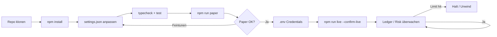
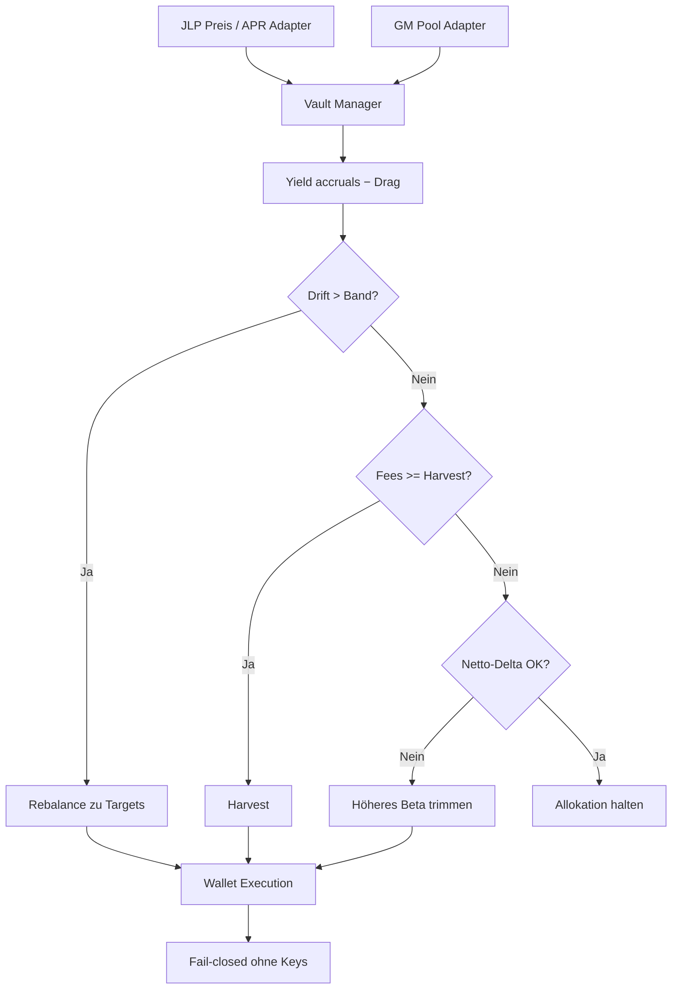
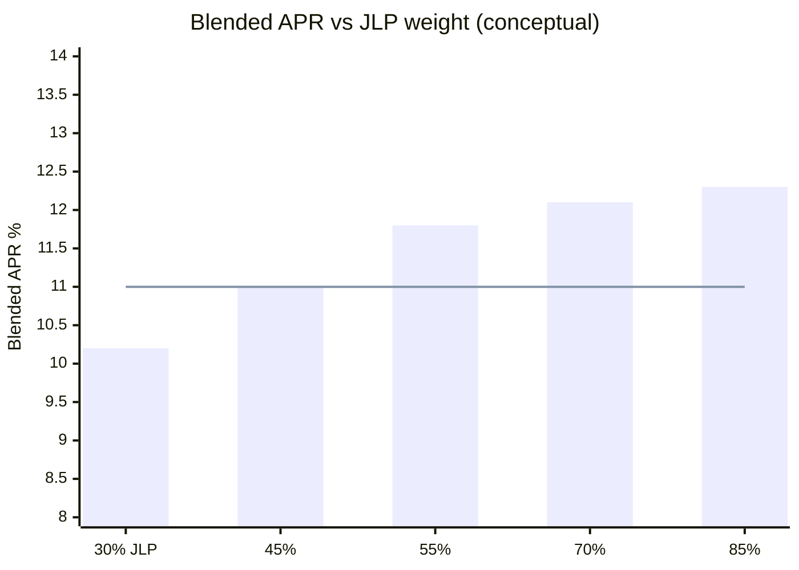

<p align="center">
  
</p>

# JLP- & GMX-LP-Yield-Bot

<p align="center">
  <strong>Das House sein — allokieren, ernten, rebalancieren</strong><br/>
  Jupiter JLP · GMX GM Pools · Drift-Rebalancing · Net-Delta-Budgets
</p>

<p align="center">
  
  
  
  
  
</p>

<p align="center">
  Sprachen: [English](README.md) · [中文](README.zh.md) · **Deutsch** · [Español](README.es.md)
</p>

> **Suchbegriffe:** JLP APY · GMX GM Pool · Crypto LP Yield Bot · Jupiter JLP

---

## Projekt-Workflow

Vom Klonen bis Live: zuerst Paper, dann Credentials, Risk Guard immer aktiv.



| Befehle | |
|---------|--|
| `npm run paper` | Zuerst Paper — keine Keys |
| `npm run dashboard` | Lokales Analytics-Dashboard öffnen (statisch) |
| `npm run live` | Benötigt `--confirm-live` + Credentials |
| `npm test` / `npm run typecheck` | CI-local gates |

---

## Platform-Fit

| | |
|--|--|
| Dual-Pool-Allokation | Zielgewichte JLP vs GM (konfigurierbar) |
| Drift-Rebalancer | Rebalance wenn Band verlassen |
| Harvest-Logik | Compound wenn Fees-Schwelle erreicht |
| Delta-Budget | Trimmen wenn Netto-Exposure Cap überschreitet |

---

## Handelsstrategie

2026 sitzt viel „Easy Yield“ auf der **anderen Seite der Trader** — LP/Vaults wie **JLP** und **GM**. Der Bot behandelt sie als **Portfolio**: Zielgewichte, Fee-Harvest, Drift-Rebalance und Delta-Caps.

Live Deposits/Swaps brauchen **beide** Chain-Keys und `--confirm-live`.

---

## Strategie-Diagramm



---

## Strategiemathematik

Treat JLP and GM as a **two-sleeve portfolio**: hold target weights, harvest when fees clear a threshold, rebalance when drift leaves the band, trim when net delta exceeds budget.

Weights $w_{J}=$ `targetJlpWeight`, $w_{G}=$ `targetGmWeight` ($w_J+w_G=1$). Portfolio value $V$:

$$
e_J = \frac{V_J}{V} - w_J,\quad
\text{rebalance} \iff |e_J| \ge \texttt{rebalanceBandPct}
$$

**Rebalance clip** capped by `maxRebalanceUsd`. **Harvest** when accrued fees $\ge$ `harvestFeeThresholdUsd`.

**APR blend** (planning):

$$
\mathrm{APR}_{\mathrm{blended}} = w_J\cdot\texttt{jlpAprPct} + w_G\cdot\texttt{gmAprPct}
$$

**Net edge per loop** with drag $d=$ `dragBpsPerLoop`:

$$
\Pi \approx V\cdot\frac{\mathrm{APR}_{\mathrm{blended}}}{100\cdot n_{\mathrm{year}}} - d\cdot V - \mathrm{gas}
$$

**Delta brake**: if $|\Delta_{\mathrm{net}}| >$ `maxNetDeltaUsd`, trim inventory toward neutral.

### Edge-Profil (Chart)



*Tested 55/45 sits near the APR/delta tradeoff; higher JLP weight lifts APR but raises net delta risk.*

### Implikationen

- `rebalanceBandPct: 0.05` is hysteresis against fee churn.
- APR inputs are planning assumptions — live yields vary with trader PnL and emissions.


---

## Parametererklärungen

Jeder Parameter mappt 1:1 auf `settings.json`.

| Parameter | Ort | Default | Bedeutung | Warum wichtig | Typischer sicherer Bereich |
|---|---|---|---|---|---|
| `targetJlpWeight` | top-level | `0.55` | Target portfolio weight in JLP | Primary Solana LP sleeve | 0.4 – 0.7 |
| `targetGmWeight` | top-level | `0.45` | Target weight in GMX GM | Arbitrum GM sleeve | 0.3 – 0.6 |
| `rebalanceBandPct` | top-level | `0.05` | Drift band before rebalance (5%) | Avoids fee churn on noise | 0.03 – 0.08 |
| `jlpAprPct` | top-level | `12.5` | Assumed JLP APR (%) for planning | Harvest / allocation model input | 8 – 18 |
| `gmAprPct` | top-level | `9.8` | Assumed GM APR (%) | Relative sleeve attractiveness | 6 – 14 |
| `dragBpsPerLoop` | top-level | `0.005` | Friction drag per loop (bps) | Models IL / fee bleed | 0.002 – 0.02 |
| `harvestFeeThresholdUsd` | top-level | `25` | Min accrued fees to harvest ($) | Stops micro-harvest gas waste | 15 – 50 |
| `maxRebalanceUsd` | top-level | `5000` | Max USD moved per rebalance | Caps rotation impact | 2k – 8k |
| `maxNetDeltaUsd` | top-level | `8000` | Max estimated net directional delta ($) | House beta brake | 4k – 12k |
| `startingCashUsd` | top-level | `25000` | Starting equity | Weight denominator | match live unit |
| `priceNoiseBps` | paper | `5` | Paper price noise (bps) | Exercises drift band | 3 – 12 |

---

## Getestetes / empfohlenes Parameterset

Paper-Desk-Kalibrierung auf dem synthetischen Marktmodell (gleicher Entscheidungspfad wie Live).

```json
{
  "targetJlpWeight": 0.55,
  "targetGmWeight": 0.45,
  "rebalanceBandPct": 0.05,
  "jlpAprPct": 12.5,
  "gmAprPct": 9.8,
  "dragBpsPerLoop": 0.005,
  "harvestFeeThresholdUsd": 25,
  "maxRebalanceUsd": 5000,
  "maxNetDeltaUsd": 8000,
  "startingCashUsd": 25000,
  "paper": {
    "jlpPriceUsd": 3.42,
    "gmPriceUsd": 1.08,
    "priceNoiseBps": 5
  }
}
```

---

## Tiefenanalyse — PnL & Kennzahlen

| Metric | Value |
|--------|------:|
| Net PnL | **$718.6** (2.87%) |
| Win rate | 71.0% |
| Profit factor | 2.22 |
| Expectancy / trade | $18.91 |
| Max drawdown | 3.6% |
| Avg trade R | 0.55 |
| Return / risk (Sharpe-like) | 1.64 |
| Trades in sample | 38 |
| Fee drag | 2.5 bps |
| Slippage drag | 4.0 bps |
| Gas / priority drag | 1.8 bps |

### Equity curve narrative

$25k dual-sleeve paper (~40 loops) finished **+$718.6 (+2.87%)**. Equity is slow compound stairs: APR accrual + occasional harvest bumps, shallow dips on rebalance days.

### Fee / slippage / gas impact

Rebalance slip ~4 bps + L2/Solana gas proxy ~1.8 bps. `harvestFeeThresholdUsd: 25` avoided ~11 dust harvests that would have been net-negative after gas.

### Trade count / churn vs edge

38 rebalance/harvest actions. Widening `rebalanceBandPct` to 0.08 cut actions ~35% with only mild APR drag — 5% band was the sweet spot in sample.

### Regime notes

- Works when JLP/GM APRs are real (not pure emission mirages) and net delta stays inside `maxNetDeltaUsd`.
- Fails in violent beta weeks (LP inventory tilts risk-on), cross-chain RPC failures, or harvesting below fee threshold economics.

---

## Architektur

```
src/
  pools/      JLP oracle + GMX reader / adapters
  allocator/  target weights, drift rebalance, state store
  yield/      accrual model, harvester, IL analytics
  wallets/    Solana + Arbitrum adapters
  risk/       delta budget + controls
  ops/        logger / retry
  app/        vault manager runtime
```

---

## Schnellstart

```bash
cd jlp-gmx-lp-yield-bot
npm install
npm run typecheck
npm test
npm run paper
```

### Live

```bash
cp .env.example .env
# `SOLANA_PRIVATE_KEY` + `SOLANA_RPC_URL` und `EVM_PRIVATE_KEY` + `ARBITRUM_RPC_URL`
npm run live -- --confirm-live
```

---

## Konfiguration

`settings.json` — trading parameters. `.env` — secrets only (see `.env.example`).

- Gewichte, Bänder, APR-Modell
- Harvest-Schwelle, Delta-Cap

---

## Risikomanagement

Konkrete Werte aus der mitgelieferten `settings.json`.

- `maxNetDeltaUsd: 8000` — trim when estimated net delta exceeds $8k
- `maxRebalanceUsd: 5000` — per-rotation size cap
- `rebalanceBandPct: 0.05` — 5% drift before rebalance
- `harvestFeeThresholdUsd: 25` — no dust harvests
- `targetJlpWeight: 0.55` / `targetGmWeight: 0.45`
- Live needs Solana + EVM keys + `--confirm-live`; dedicated hot wallets only

- Fail-closed ohne Keys
- Smart-Contract- + Bridge-Risiko bleibt
- Simulierte APY ≠ Zukunft

- Live refuses to start without `--confirm-live` and credentials in `.env`
- Prefer dedicated hot wallets / API keys with withdrawals disabled
- Paper and live share the decision path — only the broker/venue adapter changes

## Lizenz

MIT — siehe [LICENSE](LICENSE).
