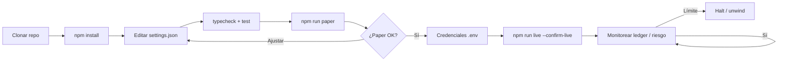
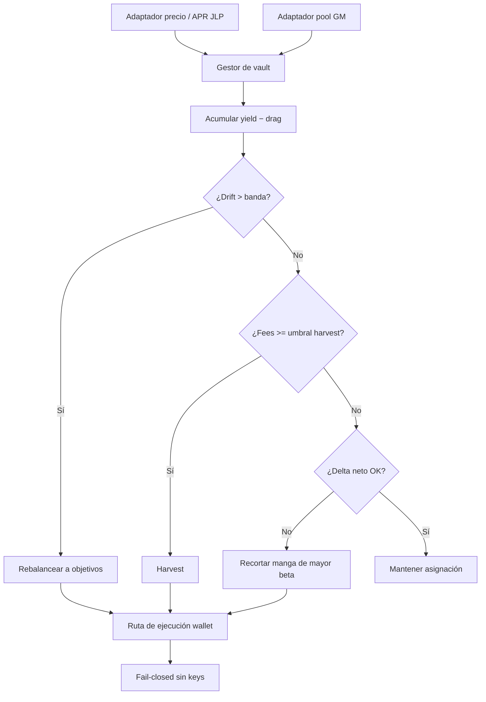

<p align="center">
  
</p>

# Bot de Yield LP JLP y GMX

<p align="center">
  <strong>Sé la casa — asigna, cosecha, rebalancea</strong><br/>
  Jupiter JLP · pools GM de GMX · rebalanceo por drift · presupuestos de delta neto
</p>

<p align="center">
  
  
  
  
  
</p>

<p align="center">
  Idiomas: [English](README.md) · [中文](README.zh.md) · [Deutsch](README.de.md) · **Español**
</p>

> **Palabras clave:** APY JLP · pool GM GMX · bot de yield LP · Jupiter JLP

En 2026 gran parte del “yield fácil” está del **otro lado de los traders** — productos LP/vault como **JLP** y **GM**. Este bot los trata como **portfolio**: pesos objetivo, harvest de fees, rebalanceo por drift y tope de beta direccional.

---

## Flujo del proyecto

Camino completo de clon a live: primero paper, luego credenciales, riesgo siempre activo.



| Comandos | |
|---------|--|
| `npm run paper` | Primero modo paper |
| `npm run live` | Requiere `--confirm-live` + credenciales |
| `npm test` / `npm run typecheck` | CI-local gates |

---

## Promesa del producto

| | |
|--|--|
| Asignación dual-pool | Pesos objetivo JLP vs GM (configurable) |
| Rebalanceador por drift | Rebalancea al salir de la banda |
| Lógica de harvest | Compone al cruzar umbral de fees |
| Presupuesto de delta | Recorta si la exposición neta supera el cap |

---

## Diagrama de estrategia



Depósitos/swaps live necesitan keys de **ambas** cadenas y `--confirm-live`.

---

## Arquitectura

```
src/
  pools/      JLP oracle + GMX reader / adapters
  allocator/  target weights, drift rebalance, state store
  yield/      accrual model, harvester, IL analytics
  wallets/    Solana + Arbitrum adapters
  risk/       delta budget + controls
  ops/        logger / retry
  app/        vault manager runtime
```

---

## Inicio rápido

```bash
cd jlp-gmx-lp-yield-bot
npm install
npm run typecheck
npm test
npm run paper
```

### Live

```bash
cp .env.example .env
# `SOLANA_PRIVATE_KEY` + `SOLANA_RPC_URL` y `EVM_PRIVATE_KEY` + `ARBITRUM_RPC_URL`
npm run live
```

---

## Configuración

`settings.json` — trading parameters. `.env` — secrets only (see `.env.example`).

- Pesos, bandas, modelo APR
- Umbral harvest, cap de delta

---

## Riesgo y seguridad

- Fail-closed sin keys
- Riesgo de contrato + bridge permanece
- APY simulado ≠ APY futuro

---

## Aviso legal

Los productos LP embeden PnL de traders, efectos tipo IL, riesgo de contrato y de bridge/cadena. Software educativo MIT — **no es asesoramiento financiero**. Usted responde por el tamaño, reglas del venue y cumplimiento.

## Licencia

MIT — ver [LICENSE](LICENSE).
