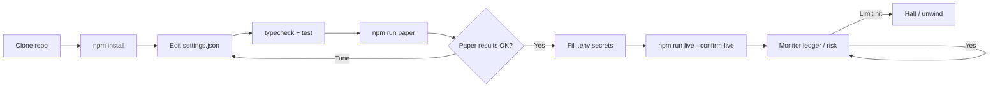
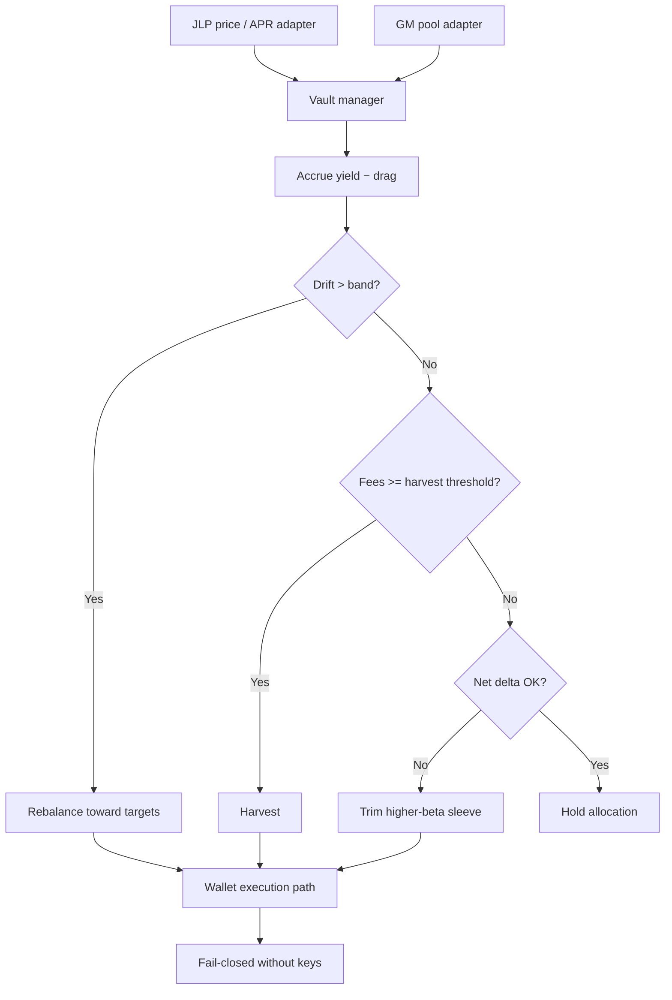

<p align="center">
  
</p>

# JLP & GMX LP Yield Bot

<p align="center">
  <strong>Be the house — allocate, harvest, rebalance</strong><br/>
  Jupiter JLP · GMX GM pools · Drift rebalancing · Net-delta budgets
</p>

<p align="center">
  
  
  
  
  
</p>

<p align="center">
  Languages: **English** · [中文](README.zh.md) · [Deutsch](README.de.md) · [Español](README.es.md)
</p>

> **Search keywords:** JLP APY · GMX GM pool · crypto LP yield bot · Jupiter JLP trading

In 2026, a huge share of “easy yield” narratives sit on the **other side of traders** — LP / vault products like **JLP** and **GM**. This bot treats them as a **portfolio**: target weights, harvest fees, rebalance drift, and cap directional beta.

---

## Project workflow

End-to-end path from clone to live — paper first, credentials last, risk always on.



| Commands | |
|---------|--|
| `npm run paper` | Paper first |
| `npm run live` | Requires `--confirm-live` + credentials |
| `npm test` / `npm run typecheck` | CI-local gates |

---

## Product promise

| | |
|--|--|
| Dual-pool allocation | Target weights for JLP vs GM (configurable) |
| Drift rebalancer | Rebalance when allocation leaves the band |
| Harvest logic | Compound when accrued fees clear a threshold |
| Delta budget | Trim when estimated net directional exposure exceeds cap |

---

## Strategy diagram



Live deposits/swaps need **both** chain keys and `--confirm-live`.

---

## Architecture

```
src/
  pools/      JLP oracle + GMX reader / adapters
  allocator/  target weights, drift rebalance, state store
  yield/      accrual model, harvester, IL analytics
  wallets/    Solana + Arbitrum adapters
  risk/       delta budget + controls
  ops/        logger / retry
  app/        vault manager runtime
```

---

## Quickstart

```bash
cd jlp-gmx-lp-yield-bot
npm install
npm run typecheck
npm test
npm run paper
```

### Live

```bash
cp .env.example .env
# `SOLANA_PRIVATE_KEY` + `SOLANA_RPC_URL` and `EVM_PRIVATE_KEY` + `ARBITRUM_RPC_URL`
npm run live
```

---

## Configuration

`settings.json` — trading parameters. `.env` — secrets only (see `.env.example`).

- Weights, bands, APR model
- Harvest threshold, delta cap

---

## Risk & safety

- Fail-closed without keys
- Smart-contract + bridge risk remain
- Simulated APY ≠ future APY

---

## Disclaimer

LP products embed trader PnL, IL-like effects, smart-contract risk, and bridge/chain risk. Educational MIT software — **not financial advice**. You are responsible for sizing, venue rules, and compliance.

## License

MIT — see [LICENSE](LICENSE).
