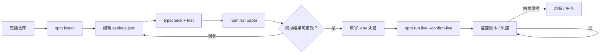
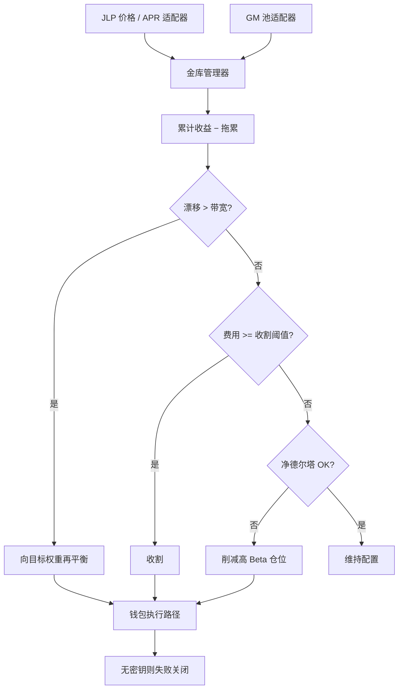

<p align="center">
  
</p>

# JLP 与 GMX LP 收益机器人

<p align="center">
  <strong>做庄一方 — 配置、收割、再平衡</strong><br/>
  Jupiter JLP · GMX GM 池 · 漂移再平衡 · 净德尔塔预算
</p>

<p align="center">
  
  
  
  
  
</p>

<p align="center">
  语言: [English](README.md) · **中文** · [Deutsch](README.de.md) · [Español](README.es.md)
</p>

> **搜索关键词:** JLP APY · GMX GM 池 · 加密 LP 收益机器人 · Jupiter JLP

2026 年大量“轻松收益”叙事站在交易者的**对手方** — 如 **JLP** 与 **GM** 等 LP/金库产品。本机器人将其视为**组合**：目标权重、收割费用、漂移再平衡，并限制方向性 Beta。

---

## 项目工作流

从克隆到实盘的完整路径：先模拟盘，后凭证，风控始终开启。



| 命令 | |
|---------|--|
| `npm run paper` | 先跑模拟盘 |
| `npm run live` | 需要 `--confirm-live` 与有效凭证 |
| `npm test` / `npm run typecheck` | CI-local gates |

---

## 产品承诺

| | |
|--|--|
| 双池配置 | JLP vs GM 目标权重（可配） |
| 漂移再平衡 | 偏离带宽时再平衡 |
| 收割逻辑 | 应计费用达阈值后复利/实现 |
| 德尔塔预算 | 净方向敞口超限时削减 |

---

## 策略流程图



实盘存入/兑换需要**两条链**密钥与 `--confirm-live`。

---

## 架构

```
src/
  pools/      JLP oracle + GMX reader / adapters
  allocator/  target weights, drift rebalance, state store
  yield/      accrual model, harvester, IL analytics
  wallets/    Solana + Arbitrum adapters
  risk/       delta budget + controls
  ops/        logger / retry
  app/        vault manager runtime
```

---

## 快速开始

```bash
cd jlp-gmx-lp-yield-bot
npm install
npm run typecheck
npm test
npm run paper
```

### 实盘

```bash
cp .env.example .env
# `SOLANA_PRIVATE_KEY` + `SOLANA_RPC_URL` 与 `EVM_PRIVATE_KEY` + `ARBITRUM_RPC_URL`
npm run live
```

---

## 配置

`settings.json` — trading parameters. `.env` — secrets only (see `.env.example`).

- 权重、带宽、APR 模型
- 收割阈值、德尔塔上限

---

## 风险与安全

- 无密钥失败关闭
- 仍有合约与跨链风险
- 模拟 APY ≠ 未来 APY

---

## 免责声明

LP 产品内嵌交易者盈亏、类无常损失、合约风险与跨链风险。 本仓库为 MIT 教育/研究软件 — **不构成投资建议**。仓位、交易所规则与合规责任由您自行承担。

## 许可证

MIT — 见 [LICENSE](LICENSE)。
