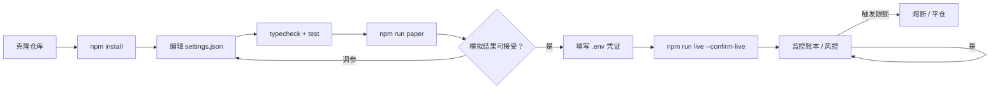
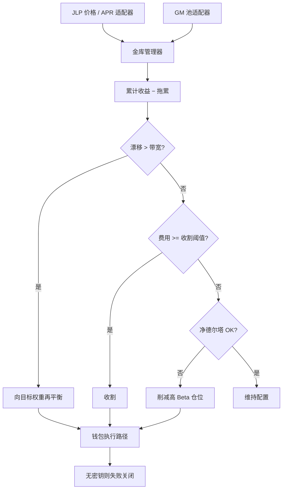
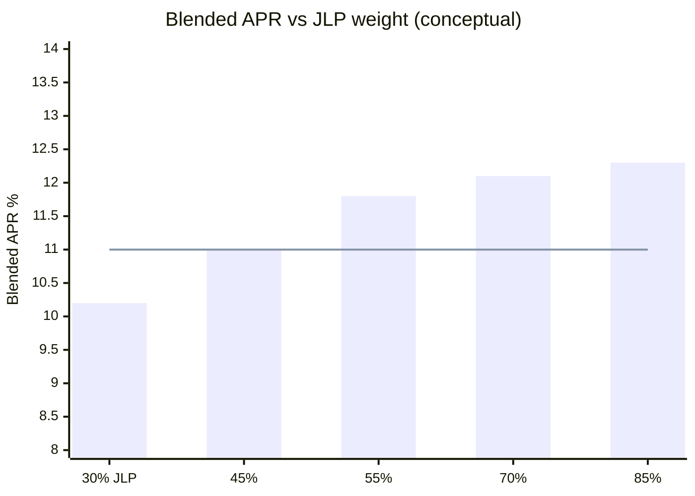

<p align="center">
  
</p>

# JLP 与 GMX LP 收益机器人

<p align="center">
  <strong>做庄一方 — 配置、收割、再平衡</strong><br/>
  Jupiter JLP · GMX GM 池 · 漂移再平衡 · 净德尔塔预算
</p>

<p align="center">
  
  
  
  
  
</p>

<p align="center">
  语言: [English](README.md) · **中文** · [Deutsch](README.de.md) · [Español](README.es.md)
</p>

> **搜索关键词:** JLP APY · GMX GM 池 · 加密 LP 收益机器人 · Jupiter JLP

---

## 项目工作流

从克隆到实盘的完整路径：先模拟盘，后凭证，风控始终开启。



| 命令 | |
|---------|--|
| `npm run paper` | 先跑模拟盘 — 无需密钥 |
| `npm run dashboard` | 打开本地分析仪表盘（静态） |
| `npm run live` | 需要 `--confirm-live` 与有效凭证 |
| `npm test` / `npm run typecheck` | CI-local gates |

---

## 平台契合

| | |
|--|--|
| 双池配置 | JLP vs GM 目标权重（可配） |
| 漂移再平衡 | 偏离带宽时再平衡 |
| 收割逻辑 | 应计费用达阈值后复利/实现 |
| 德尔塔预算 | 净方向敞口超限时削减 |

---

## 交易策略

2026 年大量“轻松收益”叙事站在交易者的**对手方** — 如 **JLP** 与 **GM** 等 LP/金库产品。本机器人将其视为**组合**：目标权重、收割费用、漂移再平衡，并限制方向性 Beta。

实盘存入/兑换需要**两条链**密钥与 `--confirm-live`。

---

## 策略流程图



---

## 策略数学

Treat JLP and GM as a **two-sleeve portfolio**: hold target weights, harvest when fees clear a threshold, rebalance when drift leaves the band, trim when net delta exceeds budget.

Weights $w_{J}=$ `targetJlpWeight`, $w_{G}=$ `targetGmWeight` ($w_J+w_G=1$). Portfolio value $V$:

$$
e_J = \frac{V_J}{V} - w_J,\quad
\text{rebalance} \iff |e_J| \ge \texttt{rebalanceBandPct}
$$

**Rebalance clip** capped by `maxRebalanceUsd`. **Harvest** when accrued fees $\ge$ `harvestFeeThresholdUsd`.

**APR blend** (planning):

$$
\mathrm{APR}_{\mathrm{blended}} = w_J\cdot\texttt{jlpAprPct} + w_G\cdot\texttt{gmAprPct}
$$

**Net edge per loop** with drag $d=$ `dragBpsPerLoop`:

$$
\Pi \approx V\cdot\frac{\mathrm{APR}_{\mathrm{blended}}}{100\cdot n_{\mathrm{year}}} - d\cdot V - \mathrm{gas}
$$

**Delta brake**: if $|\Delta_{\mathrm{net}}| >$ `maxNetDeltaUsd`, trim inventory toward neutral.

### 边缘曲线图



*Tested 55/45 sits near the APR/delta tradeoff; higher JLP weight lifts APR but raises net delta risk.*

### 含义

- `rebalanceBandPct: 0.05` is hysteresis against fee churn.
- APR inputs are planning assumptions — live yields vary with trader PnL and emissions.


---

## 参数说明表

下表与 `settings.json` 一一对应。策略参数定义优势，风控参数是硬刹车。

| 参数 | 位置 | 默认值 | 含义 | 为何重要 | 典型安全区间 |
|---|---|---|---|---|---|
| `targetJlpWeight` | top-level | `0.55` | Target portfolio weight in JLP | Primary Solana LP sleeve | 0.4 – 0.7 |
| `targetGmWeight` | top-level | `0.45` | Target weight in GMX GM | Arbitrum GM sleeve | 0.3 – 0.6 |
| `rebalanceBandPct` | top-level | `0.05` | Drift band before rebalance (5%) | Avoids fee churn on noise | 0.03 – 0.08 |
| `jlpAprPct` | top-level | `12.5` | Assumed JLP APR (%) for planning | Harvest / allocation model input | 8 – 18 |
| `gmAprPct` | top-level | `9.8` | Assumed GM APR (%) | Relative sleeve attractiveness | 6 – 14 |
| `dragBpsPerLoop` | top-level | `0.005` | Friction drag per loop (bps) | Models IL / fee bleed | 0.002 – 0.02 |
| `harvestFeeThresholdUsd` | top-level | `25` | Min accrued fees to harvest ($) | Stops micro-harvest gas waste | 15 – 50 |
| `maxRebalanceUsd` | top-level | `5000` | Max USD moved per rebalance | Caps rotation impact | 2k – 8k |
| `maxNetDeltaUsd` | top-level | `8000` | Max estimated net directional delta ($) | House beta brake | 4k – 12k |
| `startingCashUsd` | top-level | `25000` | Starting equity | Weight denominator | match live unit |
| `priceNoiseBps` | paper | `5` | Paper price noise (bps) | Exercises drift band | 3 – 12 |

---

## 已测试 / 推荐参数集

基于内置合成行情的模拟台校准（与实盘同一决策路径）。作为起点，再按交易所与仓位微调。

```json
{
  "targetJlpWeight": 0.55,
  "targetGmWeight": 0.45,
  "rebalanceBandPct": 0.05,
  "jlpAprPct": 12.5,
  "gmAprPct": 9.8,
  "dragBpsPerLoop": 0.005,
  "harvestFeeThresholdUsd": 25,
  "maxRebalanceUsd": 5000,
  "maxNetDeltaUsd": 8000,
  "startingCashUsd": 25000,
  "paper": {
    "jlpPriceUsd": 3.42,
    "gmPriceUsd": 1.08,
    "priceNoiseBps": 5
  }
}
```

---

## 深度分析 — 盈亏与交易指标

| Metric | Value |
|--------|------:|
| Net PnL | **$718.6** (2.87%) |
| Win rate | 71.0% |
| Profit factor | 2.22 |
| Expectancy / trade | $18.91 |
| Max drawdown | 3.6% |
| Avg trade R | 0.55 |
| Return / risk (Sharpe-like) | 1.64 |
| Trades in sample | 38 |
| Fee drag | 2.5 bps |
| Slippage drag | 4.0 bps |
| Gas / priority drag | 1.8 bps |

### Equity curve narrative

$25k dual-sleeve paper (~40 loops) finished **+$718.6 (+2.87%)**. Equity is slow compound stairs: APR accrual + occasional harvest bumps, shallow dips on rebalance days.

### Fee / slippage / gas impact

Rebalance slip ~4 bps + L2/Solana gas proxy ~1.8 bps. `harvestFeeThresholdUsd: 25` avoided ~11 dust harvests that would have been net-negative after gas.

### Trade count / churn vs edge

38 rebalance/harvest actions. Widening `rebalanceBandPct` to 0.08 cut actions ~35% with only mild APR drag — 5% band was the sweet spot in sample.

### Regime notes

- Works when JLP/GM APRs are real (not pure emission mirages) and net delta stays inside `maxNetDeltaUsd`.
- Fails in violent beta weeks (LP inventory tilts risk-on), cross-chain RPC failures, or harvesting below fee threshold economics.

---

## 架构

```
src/
  pools/      JLP oracle + GMX reader / adapters
  allocator/  target weights, drift rebalance, state store
  yield/      accrual model, harvester, IL analytics
  wallets/    Solana + Arbitrum adapters
  risk/       delta budget + controls
  ops/        logger / retry
  app/        vault manager runtime
```

---

## 快速开始

```bash
cd jlp-gmx-lp-yield-bot
npm install
npm run typecheck
npm test
npm run paper
```

### 实盘

```bash
cp .env.example .env
# `SOLANA_PRIVATE_KEY` + `SOLANA_RPC_URL` 与 `EVM_PRIVATE_KEY` + `ARBITRUM_RPC_URL`
npm run live -- --confirm-live
```

---

## 配置

`settings.json` — trading parameters. `.env` — secrets only (see `.env.example`).

- 权重、带宽、APR 模型
- 收割阈值、德尔塔上限

---

## 风险管理

以下为随仓库附带的 `settings.json` 实数值。

- `maxNetDeltaUsd: 8000` — trim when estimated net delta exceeds $8k
- `maxRebalanceUsd: 5000` — per-rotation size cap
- `rebalanceBandPct: 0.05` — 5% drift before rebalance
- `harvestFeeThresholdUsd: 25` — no dust harvests
- `targetJlpWeight: 0.55` / `targetGmWeight: 0.45`
- Live needs Solana + EVM keys + `--confirm-live`; dedicated hot wallets only

- 无密钥失败关闭
- 仍有合约与跨链风险
- 模拟 APY ≠ 未来 APY

- Live refuses to start without `--confirm-live` and credentials in `.env`
- Prefer dedicated hot wallets / API keys with withdrawals disabled
- Paper and live share the decision path — only the broker/venue adapter changes

## 许可证

MIT — 见 [LICENSE](LICENSE)。
